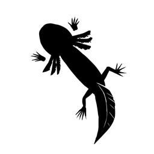

# Antilegacy Editor

This is an early prototype for a 3D editor written in modern C++ (C++20). Intended use: 3D modeling for games and animation. 


[**What I mean by "antilegacy"**](#what-is-antilegacy)

## Features

- **Cross-Platform Compatibility:** Build it natively for any system supporting Vulkan and GLFW (Windows, Linux, Mac) without any code changes. Android support with SDL2 is in the backlog, yet entirely feasible.
- **GLTF Model Import:** The editor supports GLTF as its primary import/export target, making it particularly useful for Godot users.
- **Modularity:** The code primarily consists of self-contained header files, allowing for on-the-fly reconfiguration of the editor's architecture. The upcoming C++23 will significantly reduce (already small) compilation time overhead by introducing broader support for .cpp modules.
- **Handling Non-Manifold Meshes:** Utilizing [Radial-Edge Structure](https://www.semanticscholar.org/paper/Topological-Structures-for-Geometric-Modeling-Weiler/d1410549f18f3c64055344870f1c109fb1a0afb5), the same data structure as in Blender BMesh, the editor adeptly handles non-manifold meshes. This capability enables effective manipulation of various B-rep meshes beyond 2-manifolds like the Stanford bunny.

First three features are present in the code, while the fourth is in active development.  


I don't want to rush this project, yet I am open to suggestions, pull request, and issues.

## Getting started 
While the prototype is still in its early development stage, you can build the "demo" window that renders a GLTF model.

#### Dependencies
I try to keep them to a minimum:
- **GLFW** to create a window
- **Vulkan SDK** to render to this window
- **GLM** to do some linear algebra

The setup is identical to [this wonderful tutorial](https://vulkan-tutorial.com/Development_environment), so I advise you to use it for installing dependencies.

### Linux
This is how I set up my depelopment environment:

For Vulkan:
``` bash
sudo pacman -S vulkan-devel
```
For glfw:
``` bash
sudo pacman -S glfw-x11 #I use xorg
```
For glm:
``` bash
sudo pacman -S glm
```

**I use `llvm clang`**, but you can use `gcc` for compilation. To do this, just replace this line in the `Makefile`
``` makefile
CXX = clang++
```
with this
``` makefile
CXX = g++
```
should work just fine!  

**To build** the editor, run `make test` in the project directory

If you need to **rebuild shaders**, run `make shaders`. *Note*, that you need **glslc** for that, I installed it by: 
``` bash
sudo pacman -S glslc
```

### Windows
~~Please don't~~ For those, who want to build this in Visual Studio, I added VS solution files. You still need to install [dependencies](#dependencies) and specify them in the project config window as per linked tutorial. Youx may also need some additional tweaks, as I don't build the editor on windows very often.

In the future, I hope to add some precompiled binaries, or a CMake config, as this is way handier for the end user.

### Using the executable
The viewer demo accepts paths to GLTF files as command line arguments by using the `-f` flag. The Makefile `test` target uses `Fox.gltf` from `models/` directory:

``` makefile
./$(MAIN) -f ./models/fox/Fox.gltf
```

## What is antilegacy? 
*You can call this a short version of antilegacy manifesto*

"Antilegacy" is a neat term that I coined while trying to formulate my approach to personal projects. In a few words, antilegacy software is software that tries to remain modern by any means.

### Known Reasons Why Axolotles are Cool
*Or why I go cross-platform and don't have fixed releases*

Do you know that the axolotl genome has a size of 32Gb (compared to a puny 700mb human genome)? Do you also know that these tiny, magnificent creatures grow during their entire lifespans, never leaving their aquatic stage, and can fully regenerate dissected limbs?

This extreme robustness and adaptabiliy of a living system inspired me to create software that will outlive the foundation it is built upon. I go the extra mile by creating cross-platform projects because I don't want them to be bound to any particular environment, even if it means sacrificing some optimizations. I also think that, at least for open source projects, the code should not be "production-ready" to be benefitial, and it never should be.

### The Opposite of Legacy 
*Or why I don't have backward compatibility*
I have seen software that was in produciton for decades, and the only reason it survived was the ability to change itself to fit new requiremetns. 20 years ago we had completely different abstractions, problems, and hardware. In another 20 years the situation will change again. The space of old things diminishes and the space of new things grows, that is the nature of time.

Thats why I don't care much about backward compatibility of compilers and libraries. I want my software to be able to support new systems to be, not to lag behind. I use a feature whenever it is released, because it too will become outdated one day and to be replaced by something else.

### The Ship of Theseus
*Or why do I use so many headers instead of a "proper" architecture*  
Ideally, antilegacy software is a [ship of Theseus](https://en.wikipedia.org/wiki/Ship_of_Theseus) that can and should outlive all of its parts. Thus, its parts should be replaceable, and their replacing should not threaten the entire construction. 

Thats why I rely on decoupled modules that are incapsulated inside header files. Ideally, you can replace one module with another without any dramatic changes in code. In a few years the disadvantages of my system will be gone with the new C++ module system, and my code will be ready for this.


This is an antilegacy manfesto. Perhaps this means it will never be finished and refined enough. And that is good.

## About the author
I (@unit4096) am a software developer in the gaming industry, and a graphics programmer at heart. I work on this project in my free time and try to provide consistent updates.